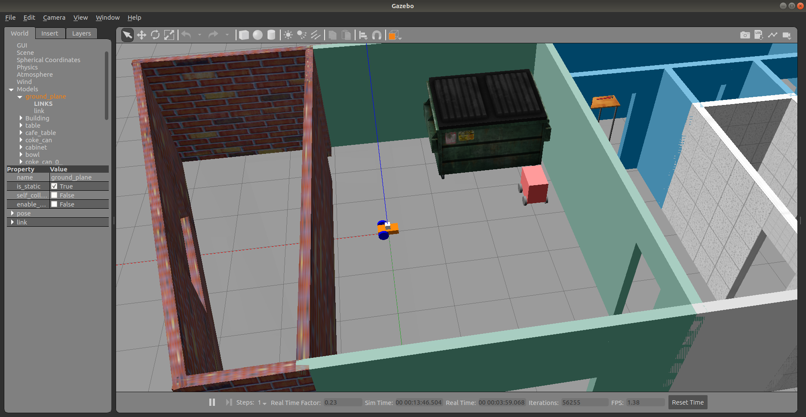
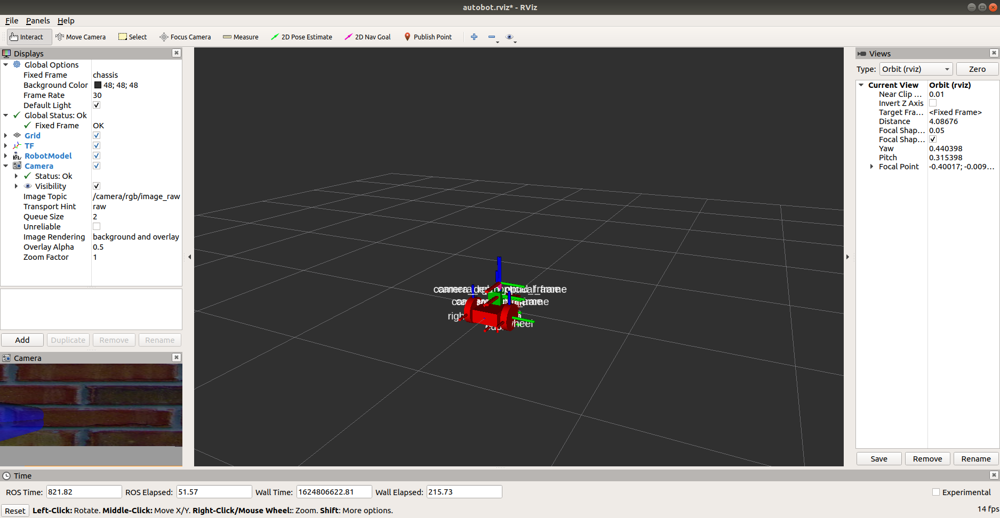
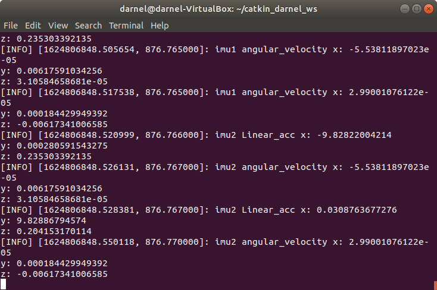

# autobot
This project aims at exploring VINS application on a differential drive robot 

Lauch the Gazebo and Rviz simulation 
```
roslaunch autobot autobot_1.launch
```

<p align="center">
  
  </p>


<p align="center">
  
  </p>

launch the imu0_subsciber.py
```
rosrun autobot imu0_subscriber.py
```

<p align="center">
  
  </p>

